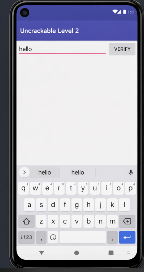
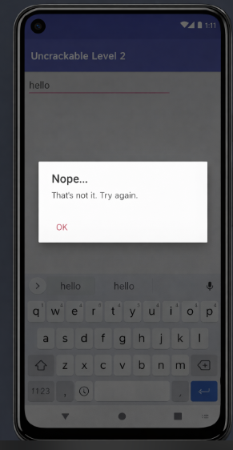
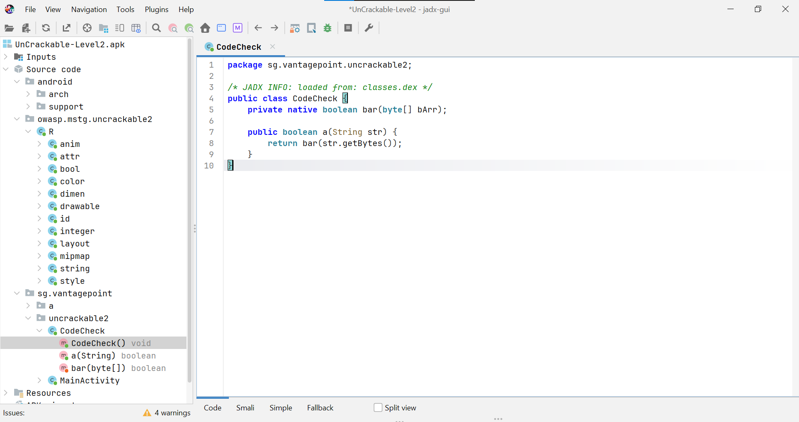
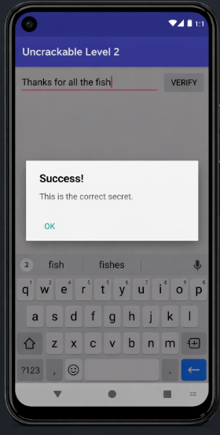

# LAB 5 : Reverse Engineering de UnCrackable Level 2

**Cours : Sécurité des applications mobiles**

---

## Objectif

Ce lab a pour but de retrouver le secret caché dans l'application Android **UnCrackable Level 2** (OWASP MSTG) en utilisant des techniques d'ingénierie inverse statique : décompilation Java, analyse du code natif avec Ghidra, et décodage du secret.

---

## Partie 1 — Découverte de l'application

### Étape 1 — Installer et lancer l'APK

La première étape consiste à installer l'application et à observer son interface. Il ne faut pas chercher à aller trop vite dans le code. Une bonne analyse commence toujours par le comportement visible.

**Action — Installer l'APK :**

```bash
adb install UnCrackable-Level2.apk
```

Lancer ensuite l'application sur l'émulateur ou l'appareil.

**Ce qu'il faut observer :**

L'application affiche une interface simple avec un champ de saisie et un mécanisme de validation. Le challenge repose sur l'idée de saisir la bonne chaîne dans le champ texte.

>  **Capture 1 — Interface de l'application (champ de saisie)**



*L'application affiche un champ texte avec un bouton VERIFY. Ici, une valeur incorrecte ("asd") est saisie.*

**Checkpoint :** À la fin de cette étape, l'application est installée et l'interface est visible.

---

### Étape 2 — Tester un mauvais mot de passe

Saisir une valeur incorrecte pour observer la réaction de l'application.

**Ce qu'il faut observer :**

Une mauvaise valeur provoque l'affichage d'un message d'erreur.

> **Capture 2 — Message d'erreur après une mauvaise saisie**



*L'application affiche "Nope... That's not it. Try again." pour toute valeur incorrecte.*

**Checkpoint :** À la fin de cette étape, il est clair que l'application attend une chaîne précise.

---

## Partie 2 — Trouver où commence la vérification

### Étape 3 — Décompiler l'APK avec JADX

Pour comprendre la logique Java, il faut ouvrir l'APK dans un décompilateur comme JADX.

**Action :**

```bash
jadx-gui UnCrackable-Level2.apk
```

Puis rechercher la classe `MainActivity`.

**Ce qu'il faut observer :**

`MainActivity` est le point de départ de la logique côté interface. C'est là que l'entrée utilisateur est récupérée puis envoyée à la logique de vérification.

### Étape 4 — Repérer l'appel de validation dans MainActivity

La chaîne entrée dans le champ texte est envoyée à une méthode de type `m.a(...)`. Cela indique qu'un autre objet prend en charge la vérification.

---

## Partie 3 — Comprendre le rôle de CodeCheck

### Étape 5 — Identifier la classe qui effectue la vérification

La méthode appelée par `MainActivity` appartient à un objet qui, dans le write-up, correspond à la classe `CodeCheck`. C'est cette classe qui fait le lien entre Java et le code natif.

**Dans JADX, chercher la classe `CodeCheck`.**

**Ce qu'il faut observer :**

- Une méthode déclarée `native`, nommée `bar`
- Une méthode publique `a(String str)` qui convertit la chaîne en bytes et appelle `bar()`

> **Note :** Dans cette version de l'APK, `System.loadLibrary("foo")` se trouve dans `MainActivity` et non dans `CodeCheck`.

>  **Capture 3 — Classe CodeCheck ouverte dans JADX**



Le code Java réel de `CodeCheck` (package `sg.vantagepoint.uncrackable2`) :

```java
package sg.vantagepoint.uncrackable2;

/* JADX INFO: loaded from: classes.dex */
public class CodeCheck {
    private native boolean bar(byte[] bArr);

    public boolean a(String str) {
        return bar(str.getBytes());
    }
}
```

**Explication :** Le mot-clé `native` signifie que la méthode `bar()` n'est pas implémentée en Java. Son code se trouve dans une bibliothèque compilée (`libfoo.so`), généralement en C ou C++. La méthode `a()` sert de pont entre le code Java et le code natif.

---

## Partie 4 — Retrouver la bibliothèque native

### Étape 6 — Extraire le contenu de l'APK

Le `System.loadLibrary("foo")` présent dans `MainActivity` indique qu'un fichier nommé `libfoo.so` doit exister dans l'APK.

**Action :**

```bash
apktool d UnCrackable-Level2.apk -o uncrackable_l2
```

Afficher ensuite le dossier `lib` :

```bash
ls -R uncrackable_l2/lib
```

**Ce qu'il faut observer :**

L'APK contient plusieurs variantes de la bibliothèque selon l'architecture, par exemple `x86` ou `ARM`.

>  **Capture 4 — Dossier lib/arm64-v8a contenant libfoo.so**


*Le fichier `libfoo.so` est visible dans le dossier `lib/arm64-v8a`.*

**Checkpoint :** À la fin de cette étape, la bibliothèque `libfoo.so` est localisée.

---

## Partie 5 — Analyser le code natif avec Ghidra

### Étape 7 — Importer libfoo.so dans Ghidra

Maintenant que la bibliothèque est trouvée, il faut l'ouvrir dans Ghidra.

> Ghidra est un outil libre d'ingénierie inverse développé par la NSA. Son interface graphique intègre un désassembleur et un décompilateur afin de faciliter l'analyse de fichiers binaires.

**Action :**

```bash
c:\ghidra_11.0_PUBLIC\ghidraRun
```

Créer un projet Ghidra puis importer, par exemple :

```
uncrackable_l2/lib/x86/libfoo.so
```

Lancer l'analyse automatique.

**Ce qu'il faut observer :**

Ghidra charge les fonctions, les symboles, les chaînes et produit un pseudo-code décompilé.

### Étape 8 — Chercher la fonction JNI liée à `bar`

Les fonctions JNI suivent un schéma de nommage particulier. OWASP MASTG explique qu'elles sont exportées avec un nom dérivé du package, de la classe et de la méthode Java.

**Dans Ghidra, rechercher un symbole contenant `Java` ou `CodeCheck_bar`.**

**Ce qu'il faut observer :**

On retrouve la fonction JNI correspondant à `bar`, avec un nom long de type :

```
Java_sg_vantagepoint_uncrackable2_CodeCheck_bar
```

---

## Partie 6 — Comprendre la comparaison avec strncmp

### Étape 9 — Lire le pseudo-code de la fonction native

**Action :**

Afficher le pseudo-code dans Ghidra et chercher les appels à `strncmp`.

**Ce qu'il faut observer :**

La fonction `bar` compare l'entrée utilisateur à une autre chaîne en utilisant `strncmp`.

>  **Capture 5 — Fonction JNI Java_sg_vantagepoint_uncrackable2_CodeCheck_bar dans Ghidra**


*Le pseudo-code Ghidra montre la comparaison avec `strncmp` et la chaîne secrète `"Thanks for all the fish"` stockée en dur dans la bibliothèque native (ligne 17).*

**Explication :** `strncmp` compare deux chaînes sur une longueur donnée. Si elles correspondent, la vérification réussit. Cela signifie qu'une chaîne secrète est stockée quelque part dans la bibliothèque.

**Ce qu'il faut retenir :**

Il n'est pas nécessaire de comprendre tout le pseudo-code. Il suffit de repérer la comparaison et la donnée utilisée comme référence. La chaîne est claire : **Thanks for all the fish**.

### Étape 10 — Retrouver la valeur comparée

La valeur utilisée dans `strncmp` peut également se présenter sous forme hexadécimale ASCII dans certains cas.

**Explication :** Dans une bibliothèque native, les chaînes ne sont pas toujours immédiatement visibles comme du texte clair. Elles peuvent être stockées sous une autre forme, ici en hexadécimal ASCII.

---

## Partie 7 — Décoder le secret

### Étape 11 — Convertir l'hexadécimal en ASCII (si nécessaire)

Si la chaîne est stockée en hexadécimal :

**Utiliser Python :**

```python
hex_data = "68616e6b7320666f7220616c6c207468652066697368"
print(bytes.fromhex(hex_data).decode("ascii"))
```

**Résultat attendu :**

```
hanks for all the fish
```

### Étape 12 — Inverser la chaîne pour obtenir la phrase finale

Si la chaîne ASCII est inversée :

**Utiliser Python :**

```python
s = "hsif eht lla rof sknahT"
print(s[::-1])
```

**Résultat attendu :**

```
Thanks for all the fish
```

**Explication :** Le secret n'est pas stocké directement sous sa forme lisible. Une inversion simple a été utilisée pour rendre la découverte moins immédiate.

---

## Partie 8 — Valider la solution

### Étape 13 — Tester le secret dans l'application

Il faut maintenant revenir à l'application et saisir la chaîne trouvée.

**Action — Entrer la valeur suivante dans le champ texte :**

```
Thanks for all the fish
```

**Ce qu'il faut observer :**

Le write-up confirme que cette chaîne est acceptée par l'application.

>  **Capture 6 — Validation réussie : "Success! This is the correct secret."**



*L'application affiche "Success! This is the correct secret." confirmant que le secret a bien été retrouvé.*

**Checkpoint final :** Le challenge est résolu.

---

## Ce qu'il faut retenir

- Une application Android peut déléguer la logique de vérification à une bibliothèque native (`.so`).
- Le code natif n'est pas lisible directement ; il faut utiliser un outil comme **Ghidra** pour le décompiler.
- Les fonctions JNI suivent un schéma de nommage prévisible, ce qui permet de les identifier rapidement.
- Le secret peut être stocké en clair dans le binaire natif, ou légèrement obfusqué (encodage hex, inversion de chaîne).
- L'analyse statique seule suffit ici pour retrouver le secret sans exécuter de code instrumenté.

---

## Outils utilisés

| Outil | Usage |
|-------|-------|
| `adb` | Installation de l'APK sur l'émulateur |
| `apktool` | Extraction du contenu de l'APK |
| **JADX** | Décompilation du bytecode Java/Dalvik |
| **Ghidra** | Analyse et décompilation du code natif ARM64 |
| **Python** | Décodage hexadécimal et inversion de chaîne |

---

## Résumé du flux de l'application

```
Utilisateur saisit une chaîne
        ↓
MainActivity.verify()
        ↓
CodeCheck.a(String)
        ↓
CodeCheck.bar(byte[])  ← méthode native
        ↓
libfoo.so → Java_sg_vantagepoint_uncrackable2_CodeCheck_bar()
        ↓
strncmp(entrée, "Thanks for all the fish", 23)
        ↓
Succès ou Échec
```
